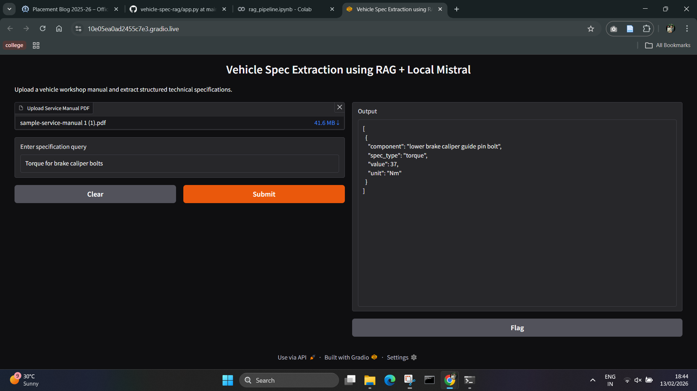

**Vehicle Specification Extraction using RAG + Local LLM (Mistral-7B)**

This project implements a Retrieval-Augmented Generation (RAG) pipeline to extract structured automotive specifications from workshop manuals using a locally hosted LLM (Mistral-7B).

**Problem Statement**

Automotive workshop manuals contain large volumes of unstructured technical data such as torque values, capacities, tools, and specifications. Extracting structured information manually is time consuming and error prone.

**Approach**

Pipeline stages:

1. PDF ingestion using PyMuPDF
2. Semantic sentence-based chunking
3. Dense embeddings using Sentence-Transformers (all-mpnet-base-v2)
4. FAISS vector retrieval
5. Local LLM inference (Mistral-7B-Instruct, 4-bit quantized)
6. Structured JSON extraction

This enables:

* offline inference
* low-latency local execution
* scalable retrieval over large manuals
* deterministic structured outputs

**Model Choices**

Embeddings

Sentence-Transformers (all-mpnet-base-v2)

Reason:

* strong semantic similarity performance
* efficient dense vector retrieval
* good performance on technical text

LLM

Mistral-7B-Instruct (local deployment)

Reason:

* strong instruction following
* efficient 4-bit quantization support
* runs on single GPU
* no external API dependency

**Repository Structure**

vehicle-spec-rag/

│

├── notebook/

│   └── rag\_pipeline.ipynb

│

├── src/

│   ├── pdf\_reader.py

│   ├── chunking.py

│   ├── embedding.py

│   ├── retrieval.py

│   ├── extractor.py

│   └── pipeline.py

│

├── data/

│   └── sample\_manual.pdf

│

├── output/

│   └── example\_results.json

│

├── requirements.txt

└── README.md

**Setup :**

pip install -r requirements.txt

**Run** :

Use notebook: notebook/rag\_pipeline.ipynb

**User Interface (Gradio)**

A simple Gradio-based interface is provided for interactive specification extraction.

Features:

* Upload vehicle service manual (PDF)
* Enter specification query
* Retrieve structured JSON output
* Runs on local LLM (Mistral-7B)

Run UI locally: python app.py

**UI Preview**

Single query Example:

Torque specification for brake caliper bolts

Example Output:\[

                {

                  "component": "Brake caliper bolts",

                  "spec\_type": "Torque",

                  "value": "37",

                  "unit": "Nm"

                }

               ]

\*Batch query supported\*

**Evaluation Coverage**

* This implementation demonstrates:
* LLM + retrieval fundamentals
* Modular, readable pipeline design
* Semantic search using FAISS
* Structured JSON extraction
* Local LLM inference workflow

**Future Improvements**

* OCR support for scanned manuals
* Schema validation for outputs
* Domain fine-tuning for automotive specs
